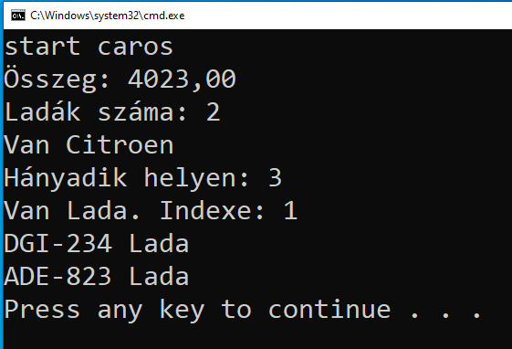

# Felhasználói dokumentáció

## Az alkalmazás célja

Az alkalmazás járművek adatait olvassa be megadott CSV formátumú fájlból.

## Telepítés

A program futtatásához Java futtató környezet szükséges.

A telepítéshez töltse le a caros.zip fájlt, majd csomagolja ki tetszőleges helyre.

## Indítás

A caros könyvtárban talál egy start.bat nevű fájl. A fájlkezelőben duplakattintással indítható az program.

## A program használata

A program bevitel nélkül fut.

